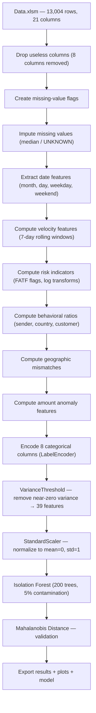

# Isolation Forest — Complete Project Explanation

> **Project**: Banking Transaction Anomaly Detection — PFE Final Year Project  
> **Dataset**: `Data.xlsm` → sheet `DETAIL` — 13,004 SWIFT wire transfers (UIB Tunisia)  
> **Model**: Isolation Forest (primary) + Mahalanobis Distance (validation)  
> **Final Feature Count**: 39 features after selection

---

## Table of Contents

1. [Pipeline Overview](#1-pipeline-overview)
2. [Raw Dataset Columns](#2-raw-dataset-columns)
3. [Dropped Columns](#3-dropped-columns)
4. [Features from Raw Data](#4-features-from-raw-data)
5. [Engineered Features — Full Breakdown](#5-engineered-features)
6. [Categorical Encoding](#6-categorical-encoding)
7. [Feature Selection & Standardization](#7-feature-selection--standardization)
8. [Isolation Forest Model](#8-isolation-forest-model)
9. [Mahalanobis Distance Validation](#9-mahalanobis-distance-validation)
10. [Complete Feature Summary Table](#10-complete-feature-summary-table)
11. [Results & Validation](#11-results--validation)

---

## 1. Pipeline Overview



---

## 2. Raw Dataset Columns

The `DETAIL` sheet contains 21 columns from UIB's SWIFT system:

| Column | Description |
|--------|-------------|
| `FC___` | **Customer ID** (Code Client / Fiche Client — anonymized with letter substitution) |
| `Libellé_cpt_` | Account type label |
| `CHRONO` | Transaction serial number |
| `Date` | Transaction initiation date |
| `ETAT` | Transaction state (always 'TR') |
| `MNT` | Transaction amount in original currency |
| `DEV` | Currency code (EUR, USD, GBP, etc.) |
| `DATE_VL` | Value date |
| `D_EXEC` | Execution date |
| `AGE` | Branch code (Code Agence) |
| `52A_EXPED` | Correspondent bank BIC code |
| `INFO_Champs_70` | Free-text payment reference |
| `FRAIS` | Fee type (OUR/SHA/BEN) |
| `chps_57` | Receiving bank BIC |
| `chps_72` | Reference codes |
| `chps_52A` | Additional SWIFT field 52A data |
| `52A_ISO_PAYS` | ISO country code of sender bank |
| `Nom_pays` | Country name in text |
| `ASSOC` | Association field |
| `ETAT_RPA` | RPA bot processing status |
| `CV EN TND` | Amount converted to Tunisian Dinar |

---

## 3. Dropped Columns

| Column | Reason |
|--------|--------|
| `ETAT` | Every row = 'TR'. Zero variance — model learns nothing |
| `ASSOC` | 98.7% missing — cannot be imputed |
| `INFO_Champs_70` | Free text — ML cannot process arbitrary text |
| `chps_72` | 54% missing — too sparse |
| `chps_57` | Almost always 'UIBKTNTTXXX' — near-zero variance |
| `Nom_pays` | Redundant with `52A_ISO_PAYS` |
| `CHRONO` | Identifier, not a behavioral feature |
| `AGE` | Branch code (Code Agence) — categorical identifier incorrectly treated as numeric, adds noise |

> **Note**: `ETAT_RPA` is kept but is **NOT a fraud label**. It records whether the RPA bot succeeded or failed.

---

## 4. Features from Raw Data

### 4.1 Numeric (used as-is)

| Feature | What It Is | Why It Matters |
|---------|-----------|----------------|
| `MNT` | Raw amount in original currency | Extreme amounts are inherently suspicious |
| `CV EN TND` | Standardized amount in TND | Allows cross-currency comparison |

### 4.2 Categorical (encoded to numbers via LabelEncoder)

| Feature | Original Values | What It Is |
|---------|----------------|-----------|
| `FC___` | ABIHIDHB, ABAHBBJF... | Customer ID (anonymized) |
| `DEV` | EUR, USD, GBP | Currency |
| `FRAIS` | OUR, SHA, BEN | Fee structure |
| `52A_ISO_PAYS` | FR, DE, US, IR | Sender country |
| `Libellé_cpt_` | CPD, CED, CDT PP | Account type |
| `52A_EXPED` | BNPAFRPP, DEUTDEFF | Sender bank BIC |
| `chps_52A` | Various SWIFT codes | Additional sender data |
| `ETAT_RPA` | VALIDE, KO_MONTANT | RPA processing result |

---

## 5. Engineered Features

These are **new columns created by the Python script** from combinations and transformations of the original Excel columns.

---

### 5.1 Missing-Value Flags

| Feature | Formula | Purpose |
|---------|---------|---------|
| `MNT_missing` | 1 if `MNT` was NaN, else 0 | Missing amount = compliance red flag |
| `CV EN TND_missing` | 1 if `CV EN TND` was NaN, else 0 | Missing converted amount = suspicious |

Created **before** imputation so the signal is preserved. In SWIFT transfers, missing financial data suggests irregular submission channels.

---

### 5.2 Date/Time Features

Extracted from 3 date columns (`Date`, `DATE_VL`, `D_EXEC`):

| Feature | Formula | Purpose |
|---------|---------|---------|
| `txn_month` | `Date.dt.month` (1-12) | Seasonal patterns (year-end spikes) |
| `txn_day` | `Date.dt.day` (1-31) | Day-of-month patterns |
| `txn_weekday` | `Date.dt.weekday` (0=Mon, 6=Sun) | Day-of-week patterns |
| `vl_month/day/weekday` | Same from `DATE_VL` | Value date patterns |
| `exec_month/day/weekday` | Same from `D_EXEC` | Execution date patterns |

> **Note**: `txn_weekend`, `vl_weekend`, `exec_weekend` are also computed but removed by VarianceThreshold if variance < 0.01.

#### Delay Features

| Feature | Formula | Purpose |
|---------|---------|---------|
| `processing_delay_days` | `(D_EXEC - Date).days` | Long delay = compliance hold. Zero delay on large amount = bypassed checks |
| `value_delay_days` | `(DATE_VL - Date).days` | Backdated value dates = accounting manipulation technique |

---

### 5.3 Velocity Features (Rolling 7-Day Windows)

These detect sudden **bursts** of activity — a hallmark of smurfing and automated laundering.

| Feature | Grouped By | What It Detects |
|---------|-----------|-----------------|
| `txn_count_sender_7d` | `52A_EXPED` (sender bank) | A bank that normally sends 2/week suddenly sends 15 in 3 days |
| `txn_count_country_7d` | `52A_ISO_PAYS` (country) | Unusual volume spike from a specific country |
| `txn_count_account_7d` | `Libellé_cpt_` (account type) | Account type with unusual activity burst |
| `txn_count_customer_7d` | `FC___` (customer ID) | **A customer who normally does 1 transfer/month suddenly does 10 in 3 days** |

**How it works**: For each transaction, look back 7 days and count how many transactions from the same group occurred in that window. High counts = suspicious burst.

---

### 5.4 Risk Indicators

| Feature | Formula | Purpose |
|---------|---------|---------|
| `high_risk_country` | 1 if country ∈ FATF blacklist (22 countries: IR, KP, SY, YE, LY, SO, SD, MM, PK, TR, JO, EG, MA, DZ, TN, NG, AE, RU, CN, VN, PA, VE) | Encodes real-world AML compliance knowledge |
| `log_MNT` | `log(1 + MNT)` | Compresses extreme outliers (500,000 → 13.1) |
| `log_CV_EN_TND` | `log(1 + CV EN TND)` | Same for TND amounts |

---

### 5.5 Behavioral Ratio Features

These compare each transaction to **historical norms** of its group. Raw amounts alone don't tell the full story — 500,000 TND from Deutsche Bank is normal, but 500,000 TND from a small regional bank is extremely suspicious.

#### Sender-Level Ratios

| Feature | Formula | Example |
|---------|---------|---------|
| `amount_vs_sender_avg` | `CV EN TND / mean(sender's history)` | Bank usually sends 5,000 TND, today sends 150,000 → ratio = **30x** |
| `amount_vs_sender_std` | `(CV EN TND - sender_mean) / sender_std` | Z-score of +3 = 3 standard deviations above normal |

#### Country-Level Ratios

| Feature | Formula | Example |
|---------|---------|---------|
| `amount_vs_country_avg` | `CV EN TND / mean(country's history)` | Transaction from France is 10x the average French transfer |

#### Customer-Level Ratios (NEW — using FC___ as Customer ID)

| Feature | Formula | Example |
|---------|---------|---------|
| `amount_vs_customer_avg` | `CV EN TND / mean(customer's history)` | Customer ABIHIDHB usually sends 3,000 TND, today sends 200,000 → ratio = **66x** |
| `amount_vs_customer_std` | `(CV EN TND - customer_mean) / customer_std` | Z-score within the customer's own transaction history |
| `customer_sender_diversity` | Count of unique sender BICs per customer | Normal customers use 1-2 banks. Launderers use 5-10 different correspondent banks |

---

### 5.6 Geographical Mismatch Features

Designed to catch money laundering through intermediary routing.

| Feature | Formula | Example |
|---------|---------|---------|
| `country_mismatch_risk` | 1 if BIC country code ≠ declared `52A_ISO_PAYS` | BIC = COMABORJ (Bolivia), declared = FR (France) → **mismatch!** |
| `sender_country_diversity` | Count of unique countries per sender BIC | Legitimate banks = 1 country. Shell companies = 3-5 |
| `rare_currency_for_country` | 1 if currency ≠ most common currency for that country | Transaction from France in Iranian Rial → very suspicious |

> **Note on MT103**: Mismatches are common due to intermediary banks in correspondent banking. The Isolation Forest handles this correctly because it learns normal routing patterns from the 13,004 transactions and only flags mismatches when combined with other red flags.

---

### 5.7 Amount Anomaly Features

| Feature | Formula | Purpose |
|---------|---------|---------|
| `is_round_amount` | 1 if `MNT % 1000 == 0` and `MNT > 0` | Round amounts (50,000.00) suggest artificial/manual transfers. Real invoices have decimals (12,847.63) |
| `amount_rank_pct` | Percentile rank of `CV EN TND` × 100 | "This transaction is in the top 1%" — easier for the model than raw amounts |

---

## 6. Categorical Encoding

All 8 categorical text columns are converted to integers via `LabelEncoder`:

```
FC___        → FC____enc        (Customer ID)
DEV          → DEV_enc          (Currency)
FRAIS        → FRAIS_enc        (Fee type)
52A_ISO_PAYS → 52A_ISO_PAYS_enc (Country)
Libellé_cpt_ → Libellé_cpt__enc (Account type)
52A_EXPED    → 52A_EXPED_enc    (Sender bank BIC)
chps_52A     → chps_52A_enc     (SWIFT field)
ETAT_RPA     → ETAT_RPA_enc     (RPA status)
```

The original text column is dropped after encoding.

---

## 7. Feature Selection & Standardization

### Feature Selection
`VarianceThreshold(threshold=0.01)` removes any feature whose variance across all 13,004 transactions is below 0.01 (near-constant features provide no signal). **39 out of 42** features survived.

### Standardization
`StandardScaler` transforms each feature to **mean=0, std=1**. Without this, a feature ranging 0–500,000 (`CV EN TND`) would dominate over a feature ranging 0–1 (`is_round_amount`).

---

## 8. Isolation Forest Model

### How It Works
Anomalies are **easier to isolate** than normal points. The algorithm builds 200 random trees. Each tree randomly picks features and split values. Normal transactions need many splits to isolate (densely clustered). Anomalies need very few splits (rare/unusual). The average path length across all trees becomes the anomaly score.

### Parameters

| Parameter | Value | Meaning |
|-----------|-------|---------|
| `n_estimators` | 200 | Number of isolation trees |
| `contamination` | 0.05 | 5% expected anomaly rate |
| `max_samples` | auto | min(256, n_samples) per tree |
| `max_features` | 1.0 | All features available for splits |
| `bootstrap` | False | Sampling without replacement |
| `random_state` | 42 | Reproducibility |

### Outputs
- `anomaly_IF`: 1 = Normal, -1 = Anomaly
- `anomaly_score_IF`: Lower = more anomalous. Below -0.10 = highly suspicious

---

## 9. Mahalanobis Distance Validation

An independent second method measuring how far each transaction is from the center of "normal" data, accounting for feature correlations. Transactions beyond the 95th percentile are flagged.

- **Method Agreement**: 94.6%
- **`high_confidence_fraud`**: Set to 1 when **both** methods agree a transaction is anomalous (302 transactions)

---

## 10. Complete Feature Summary Table

| # | Feature | Source | Category | Type |
|---|---------|--------|----------|------|
| 1 | `MNT` | Raw | Amount | float |
| 2 | `CV EN TND` | Raw | Amount | float |
| 3 | `txn_month` | Engineered | Time | int |
| 4 | `txn_day` | Engineered | Time | int |
| 5 | `txn_weekday` | Engineered | Time | int |
| 6 | `vl_month` | Engineered | Time | int |
| 7 | `vl_day` | Engineered | Time | int |
| 8 | `vl_weekday` | Engineered | Time | int |
| 9 | `exec_month` | Engineered | Time | int |
| 10 | `exec_day` | Engineered | Time | int |
| 11 | `exec_weekday` | Engineered | Time | int |
| 12 | `processing_delay_days` | Engineered | Delay | int |
| 13 | `value_delay_days` | Engineered | Delay | int |
| 14 | `txn_count_sender_7d` | Engineered | Velocity | int |
| 15 | `txn_count_country_7d` | Engineered | Velocity | int |
| 16 | `txn_count_account_7d` | Engineered | Velocity | int |
| 17 | `txn_count_customer_7d` | Engineered | Velocity | int |
| 18 | `high_risk_country` | Engineered | Risk | binary |
| 19 | `log_MNT` | Engineered | Transform | float |
| 20 | `log_CV_EN_TND` | Engineered | Transform | float |
| 21 | `amount_vs_sender_avg` | Engineered | Behavioral | float |
| 22 | `amount_vs_sender_std` | Engineered | Behavioral | float |
| 23 | `amount_vs_country_avg` | Engineered | Behavioral | float |
| 24 | `amount_vs_customer_avg` | Engineered | Behavioral | float |
| 25 | `amount_vs_customer_std` | Engineered | Behavioral | float |
| 26 | `customer_sender_diversity` | Engineered | Behavioral | int |
| 27 | `country_mismatch_risk` | Engineered | Geographic | binary |
| 28 | `sender_country_diversity` | Engineered | Geographic | int |
| 29 | `rare_currency_for_country` | Engineered | Geographic | binary |
| 30 | `is_round_amount` | Engineered | Amount | binary |
| 31 | `amount_rank_pct` | Engineered | Amount | float |
| 32 | `DEV_enc` | Raw → Encoded | Categorical | int |
| 33 | `FRAIS_enc` | Raw → Encoded | Categorical | int |
| 34 | `52A_ISO_PAYS_enc` | Raw → Encoded | Categorical | int |
| 35 | `Libellé_cpt__enc` | Raw → Encoded | Categorical | int |
| 36 | `52A_EXPED_enc` | Raw → Encoded | Categorical | int |
| 37 | `chps_52A_enc` | Raw → Encoded | Categorical | int |
| 38 | `ETAT_RPA_enc` | Raw → Encoded | Categorical | int |
| 39 | `FC____enc` | Raw → Encoded | Categorical | int |

**Breakdown**: 2 raw numeric + 8 raw→encoded categorical + 29 engineered = **39 features**

---

## 11. Results & Validation

| Metric | Value |
|--------|-------|
| Total Transactions | 13,004 |
| Anomalies (IF) | 651 (5.01%) |
| High Confidence (both methods) | 302 |
| Method Agreement | 94.6% |
| Avg Amount — Normal | 53,099 TND |
| Avg Amount — Anomaly | 1,440,180 TND (**27.1x** normal) |
| High-Risk Country — Normal | 13.4% |
| High-Risk Country — Anomaly | **30.6%** |
| Round Amounts — Normal | 8.8% |
| Round Amounts — Anomaly | **26.1%** |
| BIC/Country Mismatch — Normal | 42.2% |
| BIC/Country Mismatch — Anomaly | **48.8%** |

The model successfully isolates transactions that are massive in size, originate from risky jurisdictions, use artificial round numbers, and deviate from customer/sender historical behavior — exactly the profile a compliance officer would investigate.
